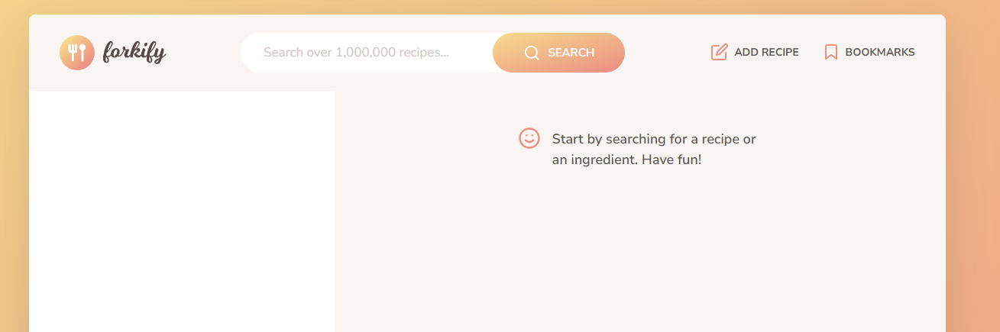
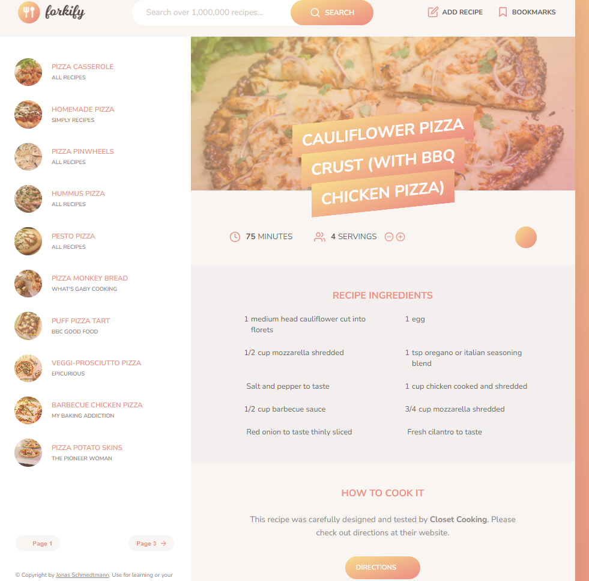
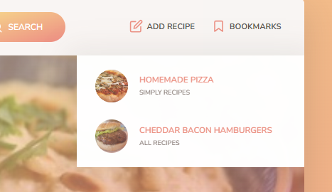
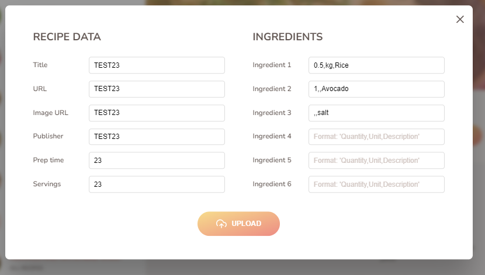

# Forkify App

**Deployment**: [Forkify App](https://omri-forkify.netlify.app/)

## Description

Forkify is a recipe application that not only allows users to discover and explore a variety of recipes but also provides dynamic features for a personalized cooking experience.

## Features:

1. **Search for Existing Recipes**: Easily find recipes based on keywords or ingredients.

2. **View Existing Recipes**: Explore a wide range of existing recipes with detailed information.

3. **Dynamic Quantity Adjustment**: Change recipe quantities dynamically based on the number of servings selected by the user.

4. **Bookmark Recipe**: Mark a recipe as a bookmark for quick access.

5. **Remove Recipe from Bookmarks**: Easily remove a recipe from your bookmarks list.

6. **Add New Recipe**: Users can add new recipes, accessible only from the user's browser that uploaded the recipe.

   
## Technologies Used

- **HTML**: Structuring the content of the application.
  
- **CSS**: Styling to provide an appealing and user-friendly interface.

- **JavaScript**: Implementing dynamic features for an interactive user experience.


## Home Screen


## Search Results


## Bookmarks


## Upload a New Recipe



## How to Run

 ```bach
   Install dependencies: npm install
   ````
```bach
  Run the application: npm start
   ````
 In your browser, enter: [http://localhost:1234/](http://localhost:1234/)


